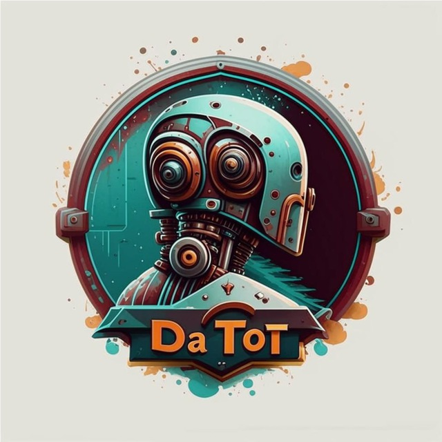

  
 \
[Ссылка на бота в телеграме](https://t.me/da_tot_bot) | Используемые API: PyTelegramBotAPI, YandexCloud API

Бот был сделан для хакатона на курсе Python ИИ от Яндекса программы «Код будущего». Представляет собой бота для знакомств, как бот Дайвинчик, но с нейросетью для генерации анкет и идей для общения.

### Авторы проекта
- Егор Бекренев (KocoyBot)
- kzttynxvxrdzxs
- Матвей Дорошкевич (fatpigmat)
### Трекер команды:
- Илья Заворотный (vompie)
